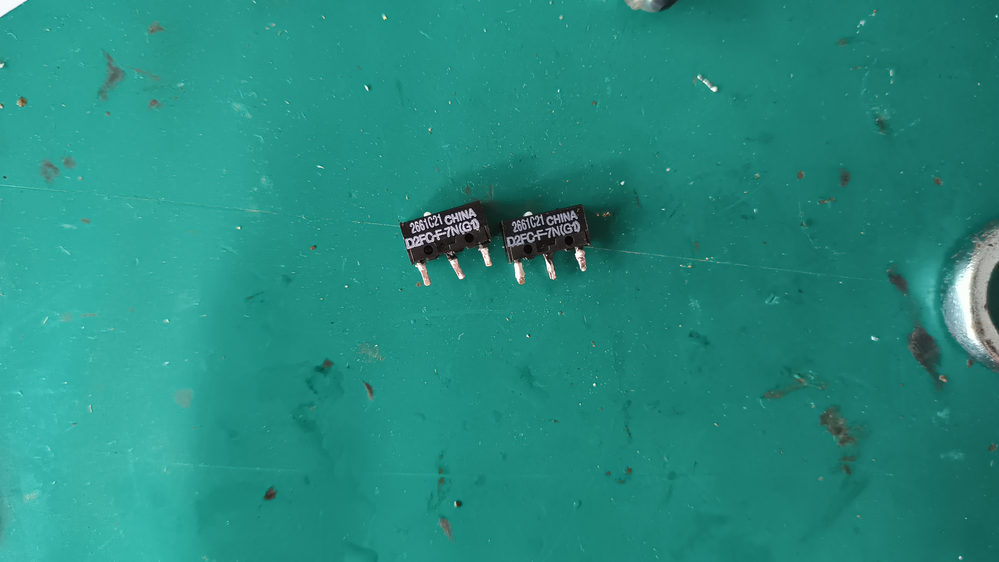

# 更换鼠标微动开关

上个月因为实在受不了手中鼠标双击的问题，又碍于不想花钱买新的鼠标，选择了购买微动开关，然后更换鼠标左右键。

这里写个帖子记录重新复盘下。

微动开关选择了：

货到手后，拆开了鼠标，因为只用过几次焊台了，不记得怎么拆件了，后面是看别人视频的操作悟的。

## 拆件

要拆微动开关，先给所有的针脚上锡，接着用烙铁头给这几个针脚同时加热，如果没法同时触碰到所有针脚的话，那就用烙铁头来回接触触碰针脚，加热同时腾出另一只手直接“拔”出元件。

上新锡原因是因为旧锡有一层氧化层，可能导热差导致没法熔锡。

拆件完成后，用吸锡带或吸锡器，把孔残留的锡清理，这样子新的元件针脚才够位置放回去。

## 装件

对准针脚，元件放平整后，先焊好一脚固定好位置，这样子焊其他针脚就没那么容易动了。

## 旧微动尸体
以下为罗技双击劣质的微动开关的尸体（bushi，乍一看也是欧姆龙，但是查型号发现好像是特供型号。

